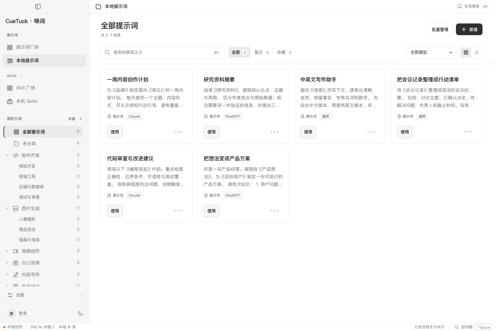
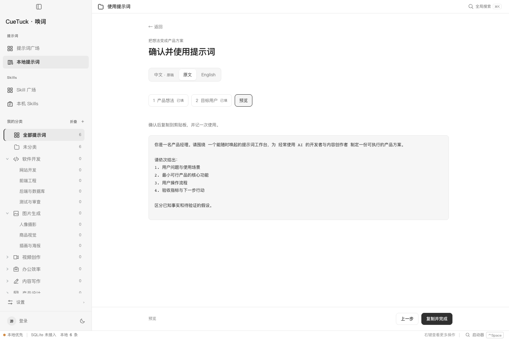
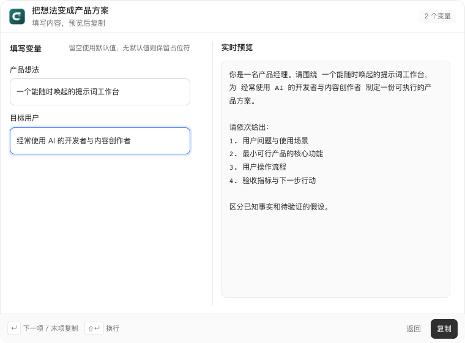

<p align="center">
  
</p>

# CueTuck · 唤词

**Your prompts, a shortcut away.**

**简体中文** · [English](docs/i18n/README.en.md) · [日本語](docs/i18n/README.ja.md) · [한국어](docs/i18n/README.ko.md) · [Español](docs/i18n/README.es.md) · [Français](docs/i18n/README.fr.md) · [Deutsch](docs/i18n/README.de.md)

本地优先的桌面提示词工作台。把常用提示词、参考图片和智能体 Skills 收好，搜索、填写变量，再复制到你正在使用的 AI 工具。

[下载预览版](https://github.com/sutao2/CueTuck/releases) · [使用与开发文档](docs/INDEX.md) · [反馈问题](https://github.com/sutao2/CueTuck/issues)


## 能做什么

| 功能 | 用法 |
|---|---|
| 提示词广场 | 按分类、模型和关键词发现内容，查看图片、来源与作者，下载到本地或收藏。 |
| 本地提示词 | 分类整理、搜索、收藏、编辑正文和参考资料；卡片或列表视图随时切换。 |
| 独立启动器 | 用可配置的全局快捷键唤起，搜索提示词、填写变量并复制；也能快捷创建、AI 优化和主动搜索广场。 |
| 翻译与 AI | 广场支持中文、原文和英文版本；本地翻译与优化使用你配置的模型，支持获取模型列表后选择。 |
| Skills 管理 | 浏览公开来源、发现本机 Skills，按智能体与安装范围管理，支持安装、备份恢复和手动检查更新。 |
| MCP 接入 | 让兼容 MCP 的智能体搜索、读取和渲染本地提示词；可显式开启公开广场工具。 |

## 从整理到使用

### 常用内容，放在本地

本地库使用 SQLite 保存。提示词可以包含 `{{变量}}` 和参考资料；需要时再登录使用广场收藏、发布和个人库同步。



### 填好变量，再复制

同一份提示词反复使用，只需填写这次的目标、受众或素材。预览完整结果后复制，原始模板仍可继续复用。



### 一个快捷键，随时唤起

启动器是独立窗口，支持键盘操作。搜索到模板后填写变量，按回车复制结果；输入新想法时，也可以选择创建提示词或 AI 优化。



> 截图来自当前源码的浏览器预览：广场使用公开内容，本地库和启动器使用自建示例。浏览器预览不包含原生 SQLite、系统快捷键和文件安装能力；这些功能需使用桌面版。预览版安装包可能落后于当前源码。

## 安装与更新

在 [GitHub Releases](https://github.com/sutao2/CueTuck/releases) 下载对应平台的附件：

| 平台 | 安装包 | 当前支持 |
|---|---|---|
| macOS · Apple Silicon | `.dmg` | arm64，已实机验证 |
| Windows | `.exe` | x64，已通过 CI 安装、启动与卸载测试 |
| Linux | — | 尚未验证 |

安装后可在 **设置 → 更新** 检查新版本，查看下载进度并确认安装。当前应用以预览版分发；macOS 包使用临时签名，尚未通过 Apple 公证，系统可能要求确认，处理方式见[安装说明](deploy/README.md)。

## 第一次使用

1. 在 **本地提示词** 新建内容，或从 **提示词广场** 下载一份模板。
2. 点击 **使用**，填写变量并复制结果到你的 AI 工具。
3. 在 **设置** 中调整启动器快捷键、语言和外观。
4. 需要本地翻译或 AI 优化时，在 **AI 与模型** 配置自己的服务地址与 API Key，获取模型列表后选择模型。
5. 需要跨设备同步、广场收藏或发布时，再登录并设置公开昵称。

“本地 AI 配置”指配置保存在本机，不代表模型离线运行。桌面版密钥存入系统凭据库；执行翻译或优化时，相关文本会发送到所选模型服务。发布到广场前，请检查正文与公开附件。

## Skills 与 MCP

**本机 Skills** 支持为 Codex、Claude Code、Cursor、Pi 和 OpenCode 等目标管理 Skill 目录，区分全局与项目范围。安装、覆盖和更新有独立确认与备份流程。安装 Skill 不会自动安装它依赖的 MCP 服务或运行脚本。详见 [Skills 规格](docs/specs/skills/spec.md)。

**MCP** 是单独构建的 Rust stdio 服务，无需 Node.js 或 uv 来运行。默认仅开放本地只读工具；在 **设置 → 网络与代理 → 智能体 MCP 接入** 生成配置，按[接入说明](docs/how-to/mcp-clients.md)完成构建和配置。

## 本地开发

准备 Node.js 22+；运行桌面版还需 Rust 和对应平台的 Tauri 构建依赖。

```bash
git clone https://github.com/sutao2/CueTuck.git
cd CueTuck/desktop
npm ci
npm test
npm run dev
```

以上启动浏览器预览。运行原生桌面窗口时，先停止预览服务，再执行 `npm run tauri dev`。

- [本机开发](docs/how-to/local-dev.md)：环境、运行与验证。
- [部署与发行](deploy/README.md)：服务端、管理端、Docker Compose 和安装包。
- [参与贡献](CONTRIBUTING.md) · [文档索引](docs/INDEX.md) · [测试门禁](docs/reference/test-gates.md)。

报告问题时请附上系统、应用版本、复现步骤和脱敏截图，勿提交密钥或会话令牌。
