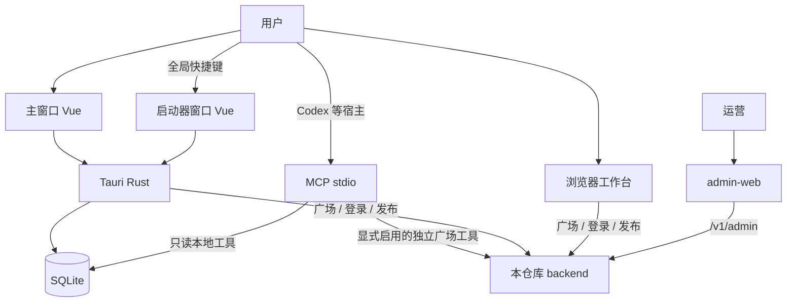

# 架构概览

| 字段 | 值 |
|---|---|
| 状态 | 现行 |
| 阶段 | M9 基线已关闭；当前交付见[项目状态](../plans/status.md) |
| 关联 | [数据模型](data-model.md) · [ADR 0008](decisions/0008-m5-backend-contract.md) · [ADR 0011](decisions/0011-web-and-mcp.md) · [ADR 0014](decisions/0014-full-product.md) |

## 容器

主窗口与启动器共享本机 SQLite。启动器默认搜索本地，显式选择广场才发起远端查询；填写页仅复制，独立的最近使用粘贴快捷键仍保留，见[启动器规格](../specs/launcher/spec.md)与 [ADR 0024](decisions/0024-launcher-copy-only.md)。MCP 的本地工具只读同一文件，宿主显式启用后才提供独立广场工具，不借用桌面令牌、不上传本地内容，见 [ADR 0021](decisions/0021-mcp-square-opt-in.md)。两者均不调用管理接口。

`admin-web` 与 `web/` 是独立浏览器应用，不进桌面安装包。`backend/` 使用 Postgres；开发默认库为 `promptark`，线上 Compose 与官网部署、数据及验证边界见[部署入口](../../deploy/README.md)。官网中的公开浏览与 `web/` 账号工作台是不同入口，不能把官网暂存内容视为账号库。浏览器工作台未登录前不声称与桌面 SQLite 文件一致；登录后的账号库见 [ADR 0014](decisions/0014-full-product.md)。

## 子系统

| 子系统 | 职责 | 范围 |
|---|---|---|
| 主窗口工作台 | 分类树、卡片及编辑/使用/账号/设置页面 | 见 ADR 0017 / 0019 / 0020 |
| 启动器 | 独立窗口本地搜索、填写复制、显式广场查询与本机 AI | 保留原生窗口；见 ADR 0023 / 0024 |
| 本地数据 | SQLite schema、工作区、FTS、备份 | 按本仓库数据模型新建 |
| 桌面集成 | 快捷键、托盘、剪贴板、粘贴、权限 | 随启动器一起移植 |
| 云与广场 | 认证、广场、发布、个人库同步、预发账单 | 见 ADR 0008 / 0014 |
| 管理台 | 用户、内容、审核、AI/翻译、站点及运营配置 | 独立合同，见[管理规格](../specs/admin/spec.md) |
| 浏览器工作台 | 独立 SPA，流体桌面布局 | M9：见 ADR 0011 |
| 本机 MCP | stdio 本地只读工具与显式启用的广场工具 | 见 ADR 0021 |

## 窗口

- `main`：工作台。
- `launcher`：独立启动器。失焦隐藏、唤起保护期、粘贴前交还焦点等行为以旧实现为准。
- 登录在主窗口工作区页面完成，见 [ADR 0020](decisions/0020-workspace-pages.md)；不另开登录窗口。
- 管理端不占用桌面窗口。

## 前端约定

- 桌面前端使用 Vue 3 + Vite；当前依赖未引入 Pinia 或 Vue Router。
- 文案简体中文，标识符英语。
- 主窗口框架遵循 [ADR 0017](decisions/0017-screenshot-workbench-frame.md)，设置与连续工作流分别遵循 ADR 0019 / 0020。
- 启动器视觉可保持旧启动器可用性，不要求与原型覆盖层一致。

## 广场后端

合同见 [ADR 0008](decisions/0008-m5-backend-contract.md) 与 [ADR 0012](decisions/0012-postgres-backend.md)。不画旧 Spring 路径。运行时是本仓库 `backend/`，默认连本机 `promptark` 库。

## 管理后端

合同见 [ADR 0009](decisions/0009-m6-admin-console.md)。独立 OpenAPI，前缀 `/v1/admin`。不把管理路径写进 `square.yaml`。
