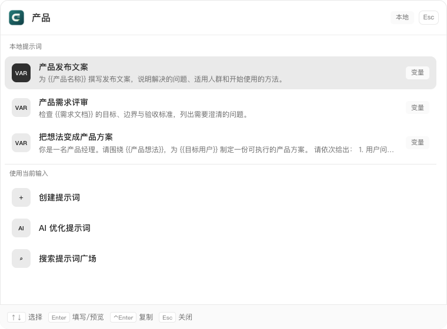

<p align="center">
  
</p>

# CueTuck · 唤词

**Your prompts, a shortcut away.**

[简体中文](../../README.md) · **English** · [日本語](README.ja.md) · [한국어](README.ko.md) · [Español](README.es.md) · [Français](README.fr.md) · [Deutsch](README.de.md)

Your desktop prompt launcher. Open CueTuck with a global shortcut, find a reusable prompt, fill its variables and copy it into your AI tool. A local library, reference images and Skills management keep your workflows close at hand.

[Website](https://prompt.likh.cn/) · [Download preview](https://github.com/sutao2/CueTuck/releases) · [Documentation](../../docs/INDEX.md) · [Report an issue](https://github.com/sutao2/CueTuck/issues)



## Keep your work moving, with one shortcut

Press **Control + Space** by default (configurable in Settings), type a keyword and navigate with **↑ / ↓**. Press **Enter** to copy a prompt without variables; otherwise fill and preview it first, then copy the result. New input can become a saved prompt, an AI optimization request using your own model, or an explicit marketplace search.

## What you can do

| Feature | Workflow |
|---|---|
| Standalone launcher | Open with a configurable global shortcut, search, fill variables and copy. Quickly create prompts, optimize with AI or explicitly search the marketplace. |
| Prompt marketplace | Browse by category, model or keyword. Inspect images, sources and authors; download prompts or save favorites. |
| Local library | Organize, search, favorite and edit prompts and references. Switch between cards and a list. |
| Translation and AI | Switch marketplace content between Chinese, original and English versions. Use your own model for local translation and optimization; fetch available models and select one. |
| Skills management | Browse public sources, discover local Skills, manage agent and installation scope, install, restore backups and check for updates manually. |
| MCP integration | Let compatible agents search, read and render local prompts. Public marketplace tools are optional. |

## Your workflow

### Keep reusable content locally

The desktop library uses SQLite. Templates support `{{variables}}` and references. Sign in when you need marketplace favorites, publishing or personal-library sync.


### Fill, preview, copy

Reuse a template with a new goal, audience or input. Preview the completed prompt before copying it.


### A shortcut away

The launcher runs in its own window and supports keyboard navigation. Fill variables and press Enter to copy; new input can also become a prompt or an AI optimization request.


> Screenshots show the current source in browser preview. Marketplace content is public; local and launcher content is sample data. Native SQLite, system shortcuts and file installation require the desktop app. Preview packages may lag behind current source.

## Install and update

Download an attachment from [GitHub Releases](https://github.com/sutao2/CueTuck/releases):

| Platform | Package | Support |
|---|---|---|
| macOS · Apple Silicon | `.dmg` | arm64; tested on a real Mac |
| Windows | `.exe` | x64; CI installation, launch and uninstall checks |
| Linux | — | Not yet verified |

**Settings → Updates** checks for versions, shows download progress and asks before installing. This is preview software. macOS builds use ad-hoc signing and are not Apple-notarized; see [installation notes](../../deploy/README.md) for system prompts.

## Get started

1. Create a local prompt or download a marketplace template.
2. Choose **Use**, fill variables and copy into your AI tool.
3. Configure the launcher shortcut, language and appearance in Settings.
4. Under **AI & Models**, enter your service URL and API key, fetch the model list and choose a model for local translation or optimization.
5. Sign in and set a public nickname for sync, marketplace favorites or publishing.

Local AI configuration does not imply offline inference. Desktop keys are kept in the system credential store; translation and optimization send relevant text to your selected provider. Review text and public attachments before publishing.

## Skills and MCP

Manage Skill folders for Codex, Claude Code, Cursor, Pi and OpenCode, with global and project scopes. Installation and replacement include confirmation and backup workflows. Installing a Skill does not install its MCP dependencies or run its scripts. See the [Skills specification](../../docs/specs/skills/spec.md).

MCP is a separately built **Rust stdio service**, requiring neither Node.js nor uv at runtime. Local read-only tools are enabled by default. Generate configuration under **Settings → Network & Proxy → Agent MCP integration**, then follow the [MCP guide](../../docs/how-to/mcp-clients.md).

## Development

Use Node.js 22+. Desktop development also requires Rust and platform-specific Tauri build dependencies.

```bash
git clone https://github.com/sutao2/CueTuck.git
cd CueTuck/desktop
npm ci
npm test
npm run dev
```

This starts the browser preview. Stop it before running `npm run tauri dev` for the native app.

[Local development](../../docs/how-to/local-dev.md) · [Deployment and releases](../../deploy/README.md) · [Contributing](../../CONTRIBUTING.md) · [Test gates](../../docs/reference/test-gates.md)

Most technical documentation is currently in Chinese. Include your OS, app version, reproduction steps and redacted screenshots in bug reports. Never include keys or session tokens.
